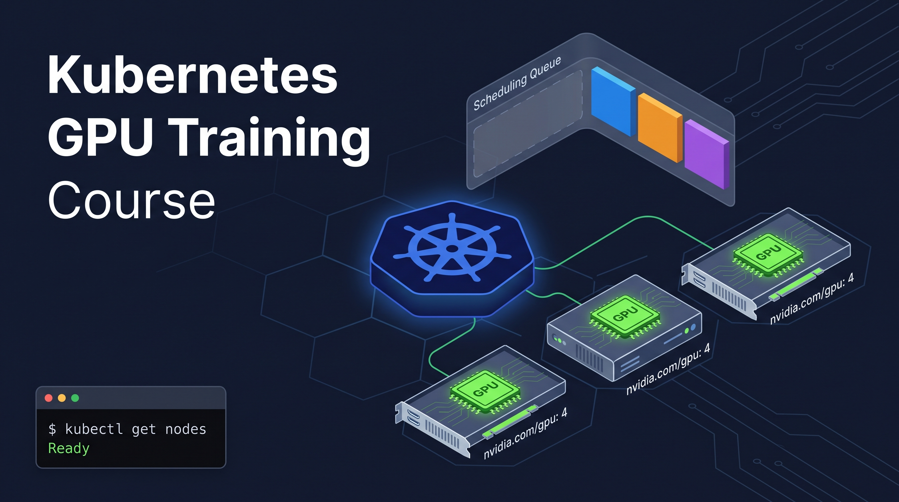

# GPU Engineering on Kubernetes

**Course 1 of 3** — GPU-Aware Kubernetes: Scheduling, Observability & Inference

A hands-on training for DevOps/SRE engineers who need to operate GPU clusters
for AI/ML workloads. No GPU hardware required for the first 4 modules — everything
runs in simulation on your laptop.

From 0 to Hero, but some basic Kubernetes knowdledge is required.

   

---


## What this course covers

You'll go from zero GPU knowledge to deploying and benchmarking a real vLLM inference
server on a GCP GPU node. Along the way you'll build the skills to run a multi-tenant
GPU platform with quota enforcement, autoscaling, and production observability.

---

## Module structure

| # | Module | Tier | Est. time |
|---|--------|------|-----------|
| 1 | GPU Fundamentals for K8s Engineers | Tier 1 (local) | 2 hr |
| 2 | Simulating GPU Clusters with KWOK | Tier 1 (local) | 3 hr |
| 3 | GPU-Aware Scheduling (Kueue + Volcano) | Tier 1 (local) | 4 hr |
| 4 | GPU Node Lifecycle & Autoscaling | Tier 1 (local) | 2 hr |
| 5 | GPU Observability with DCGM | Tier 1→2 | 3 hr |
| 6 | NVIDIA GPU Operator in Production | Tier 2 (GCP) | 2 hr |
| 7 | LLM Inference Serving with vLLM | Tier 2 (GCP) | 3 hr |
| 8 | Capstone: Multi-Tenant GPU Platform | Tier 1 + 2 | 4 hr |

---

## Two tiers, one course

**Tier 1 — Local simulation (no GPU hardware needed)**
Modules 1–4 run entirely on your laptop using KWOK virtual nodes and ghostgpu
to simulate GPU resources. RAM footprint is ~2 GB. Any 16 GB machine with Docker
can run it.

**Tier 2 — GCP GPU (real hardware)**
Modules 5–8 connect to a GCP cluster. The cost guardrail is < $10 per student
per session. A `g2-standard-4` node (1× L4 GPU, 24 GB VRAM) is used for
single-student exercises; an `a2-highgpu-1g` with 7× MIG partitions is used for
shared multi-student labs.

---

## Prerequisites

- CKA-level Kubernetes knowledge (or equivalent experience)
- Basic Linux comfort (systemd, bash, curl)
- Docker installed and working
- 16 GB RAM on your laptop
- No GPU knowledge required — that's what Module 1 is for
- No CUDA or ML framework experience needed for Course 1

---

## How to run Tier 1 locally

### 1. Install dependencies

```bash
# kind — local Kubernetes cluster
curl -Lo ./kind https://kind.sigs.k8s.io/dl/v0.25.0/kind-linux-amd64
chmod +x ./kind && sudo mv ./kind /usr/local/bin/kind

# kwokctl — KWOK cluster controller
KWOK_LATEST=$(curl -s https://api.github.com/repos/kubernetes-sigs/kwok/releases/latest | grep tag_name | cut -d'"' -f4)
curl -Lo kwokctl https://github.com/kubernetes-sigs/kwok/releases/download/${KWOK_LATEST}/kwokctl-linux-amd64
chmod +x kwokctl && sudo mv kwokctl /usr/local/bin/kwokctl

# helm — package manager
curl https://raw.githubusercontent.com/helm/helm/main/scripts/get-helm-3 | bash
```

### 2. Create the simulation cluster

```bash
# Creates a kind cluster + installs KWOK controller + deploys virtual GPU nodes
bash course-1/scripts/setup-kwok-cluster.sh
```

### 3. Install the GPU simulator

```bash
# Installs ghostgpu (fake-gpu-operator) to inject nvidia.com/gpu resources
bash course-1/scripts/install-ghostgpu.sh
```

### 4. Verify the setup

```bash
# Should show >= 2 Ready nodes with nvidia.com/gpu in their allocatable resources
kubectl get nodes
kubectl get nodes -o json | jq '.items[] | {name: .metadata.name, gpu: .status.allocatable["nvidia.com/gpu"]}'
```

---

## Directory layout

```
course-1/
├── manifests/    # Kubernetes YAML files (Kueue, Volcano, GPU Operator, etc.)
├── tasks/        # iximiuz auto-graded task definitions
├── scripts/      # Setup, validation, and benchmark scripts
├── dashboards/   # Grafana dashboard JSON exports
├── module-1/     # GPU Fundamentals
│   └── 1.lesson-gpu-fundamentals/
│       ├── index.md       # Lesson frontmatter + task definitions
│       ├── unit-1.md      # All lesson content
│       └── __static__/    # Lesson diagrams
└── README.md     # This file
```

---

## Cost guardrail

Tier 2 (GCP) sessions are designed to stay under **$10 per student**. The scripts
in `course-1/scripts/` include cost checks. GKE Cluster Autoscaler handles
scale-to-zero — GPU nodes spin down when idle.

See `deploy/node-pools/` for GKE CA node pool configs and `.kiro/steering/budget-rules.md`
for the full cost policy.
